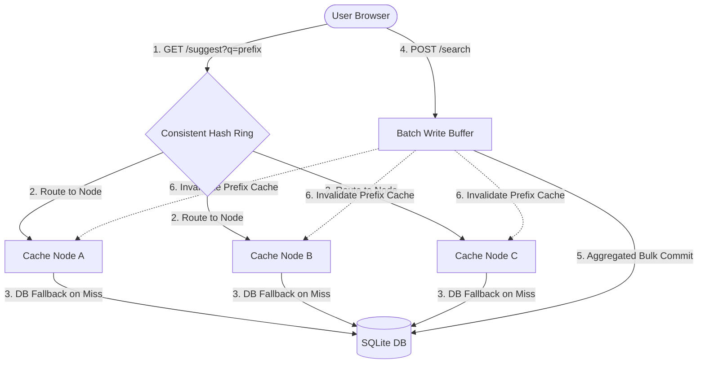

# Search Typeahead System

A high-performance, distributed-cache Search Typeahead System built in Python (FastAPI) and HTML5/CSS3. This system simulates a production-grade backend data design, highlighting distributed caching using consistent hashing, write-pressure mitigation using batch writing, and recency-boosted trending search scoring.

---

## 📐 System Architecture Diagram



---

## 1. Features & Architectural Components

### 🖥️ Interactive Control Center
* **Real-time Metrics**: Tracks average/p95 latency, cache hit rates, DB reads, database write transactions, and total searches.
* **Hash Ring Visualizer**: An SVG-based consistent hashing ring showing 150 virtual nodes. Typing inside the search bar displays the exact MD5 hash fraction and traces prefix routing to the designated cache node.
* **Cache Memory View**: Displays the active keys stored in each logical cache node in real-time.
* **Mock Traffic Simulator**: Simulates high-concurrency search volume to test consistent hashing distribution and batch writes.

### 🧩 Consistent Hashing & Distributed Caching
* **Logical Cache Nodes**: Simulates 3 independent caching nodes (`Cache-Node-A`, `Cache-Node-B`, `Cache-Node-C`).
* **Virtual Nodes**: Assigns 50 virtual nodes per cache node (150 total) to ensure uniform key distribution across the ring.
* **Prefix Routing**: Maps prefixes (`GET /suggest?q=<prefix>`) using MD5 hashing of the prefix.
* **Cache Invalidation**: Flushes database updates and invalidates corresponding cache prefix hierarchies (e.g., searching for `"apple"` invalidates `"a"`, `"ap"`, `"app"`, `"appl"`, and `"apple"` keys across the ring).

### 🔥 Trending Searches & Recency-Aware Ranking
* **Basic Mode**: Sorts typeahead queries purely by all-time popularity (`historical_count`).
* **Enhanced Mode**: Applies a linear time-decay scoring algorithm:
  $$Score(q) = HistoricalCount(q) + \sum_{s \in RecentSearches(q)} \max\left(0, 1 - \frac{t_{now} - t_s}{\text{window\_size}}\right) \times \text{boost\_factor}$$
* This ensures that search spikes cause a query to trend immediately and decay linearly back to its historical baseline when the traffic spike subsides.

### 📦 Batch Writes & Write-Reduction
* **In-Memory Buffer**: Intercepts search submissions (`POST /search`) and accumulates them in an in-memory queue.
* **Flush Thresholds**: Writes to the primary SQLite database only when:
  1. The buffer reaches the configurable count threshold (default: `10`).
  2. The flush interval timer is met (default: `5 seconds`).
* **Aggregation**: Consolidates duplicate queries in the buffer to execute a single upsert transaction, reducing database disk I/O pressure.

---

## 2. Failure Trade-offs & Mitigation

When buffering writes in memory to reduce database pressure, we face architectural trade-offs:

| Attribute | Buffering Enabled (Batch Writes) | Synchronous Writes |
| :--- | :--- | :--- |
| **Write Throughput** | Very High (Aggregated, asynchronous database commits) | Low (Disk I/O bottlenecks on every request) |
| **Read Latency** | Low (Minimal write contention on database) | Higher (Database locks during concurrent writes) |
| **Data Durability** | **Risk of Loss** (In-memory buffer is volatile) | **Guaranteed** (Committed immediately to disk) |

### Crash Scenarios
If the application crashes, power fails, or the process is killed before the buffer is flushed:
* **Impact**: Buffered searches within the last `batch_interval` window are lost.
* **Mitigation Strategies**:
  1. **Write-Ahead Logging (WAL)**: Append searches to an append-only log file on disk before memory buffering. Replay the WAL on startup.
  2. **Distributed Commit Log (Kafka/Redis Queue)**: Use a lightweight redis queue to hold items. If the app server crashes, the redis queue persists.
  3. **Tuning Thresholds**: Decrease the batch interval/threshold in exchange for higher database write volume.

---

## 3. Running the Project Locally

### Prerequisites
* Python 3.10+
* SQLite (built-in)

### Installation
1. Clone the repository or navigate to the directory.
2. Install dependencies:
   ```bash
   pip install fastapi uvicorn pydantic
   ```
3. Initialize the database:
   ```bash
   python generate_dataset.py
   ```
4. Start the FastAPI server:
   ```bash
   uvicorn backend:app --reload
   ```
5. Open your browser and navigate to:
   ```
   http://localhost:8000
   ```

---

## 4. API Documentation

### `GET /suggest?q=<prefix>`
Retrieve the top 10 typeahead suggestions for a given prefix.
* **Parameters**: `q` (string, required)
* **Response**: List of objects containing `query` and computed `score`.

### `POST /search`
Submit a search query, adding it to the batch-write buffer.
* **Body**: `{"query": "search_term"}`
* **Response**: `{"message": "Searched", "query": "search_term"}`

### `GET /cache/debug?prefix=<prefix>`
Examine cache routing statistics for a prefix.
* **Parameters**: `prefix` (string, required)
* **Response**: Details on responsible cache node, hit/miss status, TTL remaining, and hash ring position.

### `GET /cache/ring`
Returns the hash ring fractions of all virtual nodes on the consistent hashing ring.

### `GET /metrics`
Retrieve system metrics (hits/misses, DB reads/writes, latency profiles, active cache keys).

### `GET /trending`
Retrieve the Top 10 overall popular terms and Top 10 recency-boosted trending terms.
